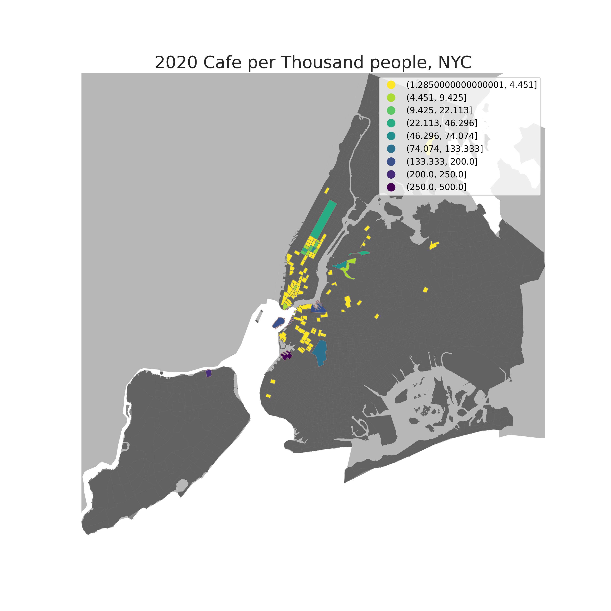
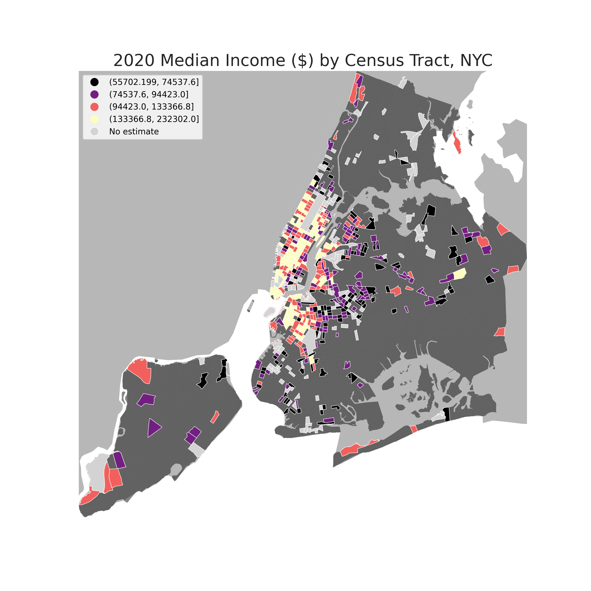

# Understanding Clustering of Cafes in NYC
### (Third Wave and Local Cafe)

## Brief:
The proposed project titled "Understanding Clustering of Third Wave and Local Cafes in NYC" aims to examine the spatial patterns and factors that contribute to the clustering of these types of cafes within the city of New York. This project is inspired by the article "The Next Wave: Predicting the future of coffee in New York City, Links to an external site." which highlights the increasing popularity of third wave and local cafes in the city. These types of cafes are characterized by their focus on specialty coffee, unique atmosphere, and locally-sourced ingredients, and have been driving the growth of the coffee industry in the city.

The main research questions for this project are:

- Where is the clustering of third wave and local cafes occurring in NYC?

- What aspects of the surrounding neighborhood, such as income, age, gender, or dependency ratio, are affecting the clustering of these cafes?

- How far are people willing to travel to access these cafes?

To address these research questions, the project will utilize two datasets: the OSM POI data, which provides point data on the locations of cafes filtered as "cafe," and the census tracts data, which includes demographic information on the surrounding neighborhoods such as income, age, gender, and dependency ratio. These datasets will be analyzed using GIS tools and spatial analysis techniques in python, including chloropleth maps, multi-linear regression, and distance analysis.

The static maps portion of the project will include chloropleth maps visualizing the median age of the surrounding neighborhoods and the cafe per thousand people ratio. A multi-linear regression will also be conducted on the census tracts with the highest cafe per thousand people ratio to examine the relationships between these variables.

The interactive map portion of the project will utilize a florium map with a heatmap layer to visualize the locations of the cafes and the analysis conducted in the static maps portion. This map will also allow the user to toggle between the various layers of analysis to further explore the data.

There are no major concerns with obtaining and cleaning the data for this project. However, care will need to be taken to ensure that the data is accurately merged and analyzed, and that any outliers or anomalies are properly accounted for in the analysis.

Overall, this project aims to provide a more detailed understanding of the clustering of third wave and local cafes in NYC and the factors that contribute to this clustering. By utilizing GIS tools and spatial analysis techniques, the project will be able to provide insights that can inform the decisions of cafe owners, urban planners, and policymakers.

The cafe point data was obtained from the OpenStreetMap (OSM) database using the OverPass Turbo API. The census tract data were obtained from the TIGER shapefiles and census demographics data, which the US Census Bureau provided.
OSM prepared the Data, and it is not sure who and when it was prepared by. This is one of the limitations of the research.
The cafe point data was originally in a geospatial format, while the census tract data was in the form of shapefiles and a CSV file. To make the data mappable, it may be necessary to perform a spatial join between the cafe point data and the census tract data, which combines the attributes of the two datasets based on their spatial relationship. Additionally, it may be necessary to perform data aggregation to summarise the data at a higher level of resolution, such as at the level of census tracts or neighborhoods.
There were issues in data quality, one of them were outliers both in case of the number of cafes and lower quantiles of population, additionally, another issue experienced was census tracts with less population by more number of cafes; these are the outliers like JFK airport, we will remove them further. Otherwise, in terms of data quality, OSM dataset is not reliable, there are total ~3,600 coffee shops in nyc and the dataset has only 2591 observations. Since this is an academic project and our focus is strictly on methodology, we are using this dataset as is. 

## Interactive Map: 
<iframe src= "map.html" height= "855" width= "95%"></iframe>

## Static Maps:

  
  

